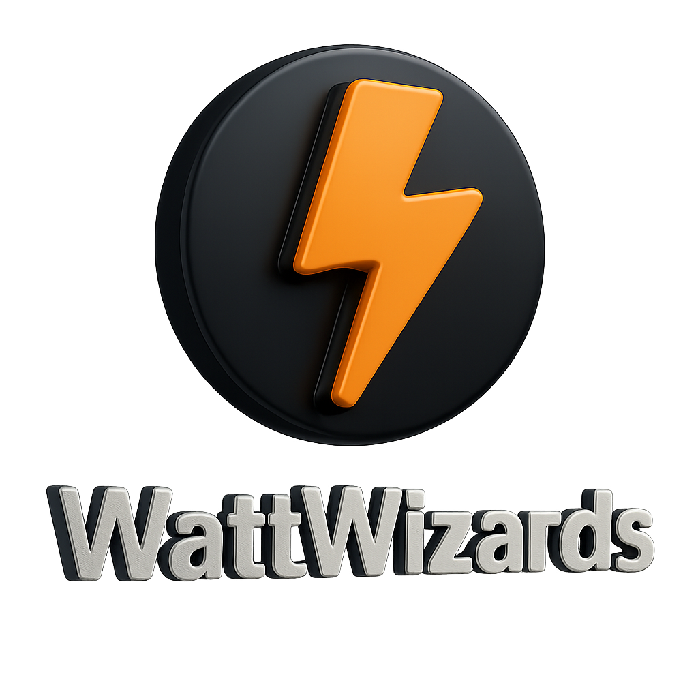

# WattWizards

> Precision Electrical Calculations & Project Management Platform  
> Developed by **Ahmed Medhat - Lucas Monir - Mazen Elsaka** • Team **XOperations**

  

## 🔌 Introduction
**WattWizards** is a powerful electrical engineering software platform that simplifies circuit analysis, power calculations, and project workflows — tailored for industrial and academic environments.

Key Features:
- ⚡ Real-time & offline circuit computation
- 📁 Project and inventory management
- 💡 Smart load analysis tools
- 🌐 Full-stack, cross-platform accessibility

## 🚀 Development Journey
| Phase | Description |
|-------|-------------|
| 🧪 Excel Tool | Early prototype using Microsoft Excel for basic calculations |
| 💻 Python GUI | Desktop-based tool with a more structured interface |
| 🌍 Web App | HTML5 + CSS3 + JS conversion for browser-based utility |
| 🔧 Final Platform | Full-stack React + Node/Express + MySQL solution |

## 📈 Insights & Data
Surveys conducted among electrical engineers revealed:
- A strong need for **error-proof calculation tools**
- Preference for **visual, user-friendly UI**
- Interest in **managing inventory and projects** in one platform

These findings directly influenced the platform’s architecture and design decisions.

## 🛠 Tech Stack & Tools
| Tool/Tech | Purpose | Logo |
|----------|---------|------|
| **[Node.js](https://nodejs.org/)** | Server-Side JavaScript Runtime |  |
| **[Express.js](https://expressjs.com/)** | Backend Framework (REST API) |  |
| **[Postman](https://www.postman.com/)** | API Testing & Documentation |  |
| **[MySQL](https://www.mysql.com/)** | Database System |  |
| **[React.js](https://reactjs.org/)** | Frontend JS Library |  |
| **[Figma](https://figma.com/)** | UI/UX Design |  |
| **[Bootstrap 5](https://getbootstrap.com/)** | CSS Framework |  |

## 📚 References
1. IEEE - *Power Factor Correction Solutions*  
2. Iowa State University - *Electrical Units Conversion*  
3. UT Dallas - *Electricity & Magnetism Equation Sheet*  
4. ELSewedy Cables - *Industrial Power Cables Catalog*

## 📜 License
**WattWizards** is a proprietary software product by the **XOperations** team.  
All content is protected under copyright.
> ⚠️ **All Rights Reserved.** This project is not open-source.  
> Unauthorized use, distribution, or reproduction is strictly prohibited.

## 🧠 Want to Contribute or Collaborate?
We’re currently in closed development, but if you're a developer, engineer, or contributor who’s passionate about electrical tech — let’s talk. DM the **XOperations Team**.

## 👨‍💻 Author
**Ahmed Medhat**  
Lead Developer – WattWizards  
📧 xoperations.contact@gmail.com

*Crafted with ❤️ by the XOperations Team*